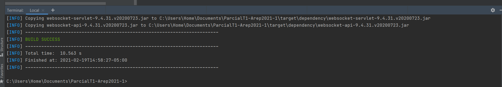
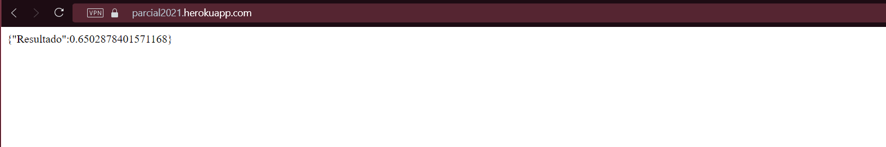

### Parcial Primer Tercio Arep2021-1
>

## Instalación
>
Descargar la apliación en nuestro ordenador, con el comando :
 ```
 $ https://github.com/santiagolaiton2700/ParcialT1-Arep2021-1
 ```
Compilar el proyecto :
 ```
 $ mvn package
 ```
Ejecutar el proyecto desde el metodo principal :
 ```
 $ mvn exec:java -Dexec.mainClass="edu.escuelaing.arep.parcial.spark"

 ```
Estructura del proyecto en forma de arbol :
 ```
 $ tree
 ```
## Ejecución
>
Muestra de la compilación del proyecto mvn package : ```$ mvn package ```



Muestra de la compilacion de la clase principal :


Muestra de la compilacion de las pruebas con :```$ mvn test ```


Ejecución del aplicativo en Heroku :

- Para hacer un calculo diferente este cambiando los valores de funcion por (cos,sen,tan) y el numero del cual desea calcular.

[Calculadora](https://parcial2021.herokuapp.com/?funcion=sen&numero=15)

Muestra de la aplicación en ejecución :



Muestra del cliente en ejecución :


Circle Ci :
[](https://circleci.com/gh/santiagolaiton2700/ParcialT1-Arep2021-1)

# Tecnologias implementas:
- mvn
- Java
- Spark

## Construido por:
- Santiago Agustin Laiton Cubides
- Santiago.laiton@mail.escuelaing.edu.co

  
  
  
